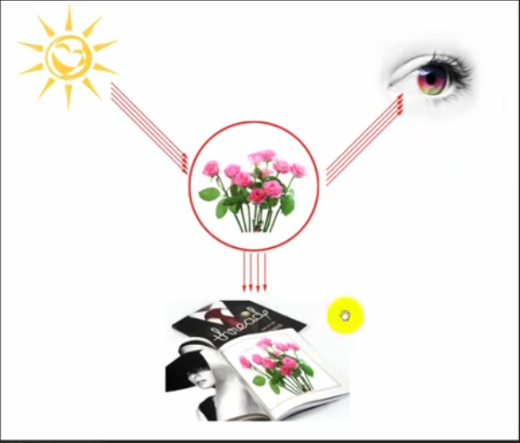

### 颜色模式

* 互补色相互吸收
* 物质吸收光，呈现吸收光的互补色
* 所有的色彩模式，都是为了还原自然世界
* 在PS中，每种调色命令都对应着一种色彩模式，大部分是RGB

#### RGB
* RGB 是颜色的本质。是站在自然界的角度。
* R==G==B，呈现出黑色到白色的过渡，灰色。
* 255
* 黑色背景，滤色
* 随机给一组数，确定大概颜色
    * 直方图法
        * 最小数为基准，是灰色
        * 两种颜色的混合部分 和 最后一种颜色 进行比较即可
* 基于RGB的调色命令
    * 曲线

### HSB
* H:hue色相
* S:saturation饱和度
* B:brightness亮度
* 100%
* 色相环，0°-360°
* 基于HSB的调色命令
    * 色相/饱和度

### CMYK
* C:青
* M:品红
* Y:黄
* K:黑
* 白色背景，正片叠底
* 基于CMYK的调色命令
    * 色彩平衡
    * 可选颜色

### 实战
* 红 绿 蓝 青 品 黄 的色环位置
* 如果把青色和黄色两种颜料混合，在白光照射下，由于颜料吸收了红色和蓝色，而反射了绿色
* 两种颜料，青色和黄色颜料，青色颜料反射青色光，黄色颜料反射黄色光；青色光+黄色光=绿色光

### 图层
* 背景图层

### 图层样式
* 最开始叫“图层效果”
* 斜面和浮雕
    * 内斜面
        * 沿着边向内斜
    * 外斜面
        * 沿着边向外斜
    * 浮雕
        * 沿着边内外斜
    * 描边浮雕
        * 必须有描边
    * 方向：光的方向
    * 使用全局光：所有样式使用统一的光
    * 纹理
* 描边
* 内阴影
* 内发光
* 光泽
* 颜色叠加
* 渐变叠加
* 图案叠加
* 外发光
* 投影

### 6组27个图层混合模式
* 混合色：当前图层的颜色
* 基色：当前图层下方的颜色
* 结果色：使用模式之后出现的颜色

#### 正常
* 正常
* 溶解
#### 加深模式组（Darken/Shadow）
* 变暗
正片叠底
颜色加深
线性加深
深色

#### 减淡模式组（Lighten/Glow）
变亮
滤色
颜色减淡
线性减淡（添加）
浅色

#### 对比模式组（Contrast）
* 黑色像素部分增强图像中的阴影，白色像素部分增强图像中的高光，运算结果将黑白像素对比合成到图像中。
叠加
柔光
强光
亮光
线性光
点光
实色混合

#### 比较模式组（两个模式组Inversion[反向] + Cancelation[取消] ）
差值
排除
减去
划分

#### 色彩模式组（Component(HSL)）
色相
饱和度
颜色
明度

